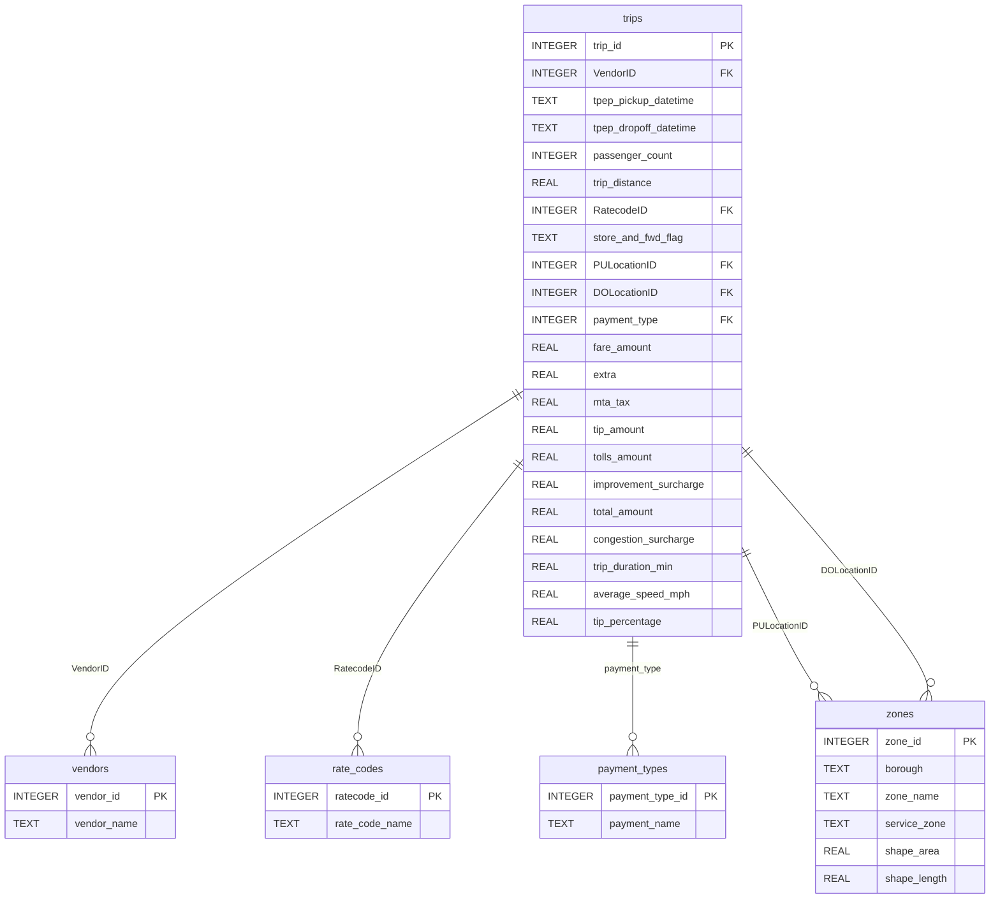

# NYC Urban Mobility — Taxi Trends & Analytics Dashboard

[](#)
[](#)
[](#)
[](#)
[](#)
[](#)
[](#)

NYC Urban Mobility is an enterprise-grade full-stack dashboard designed to process, analyze, and visualize over 7.4 million taxi rides from January 2019. The application cleans messy raw datasets, programmatically integrates spatial metadata from TLC shapefiles, stores them in an indexed SQLite database, and serves data insights via a Python Flask API to an interactive, beautifully-styled vanilla CSS dashboard.

Live Demo: [https://nyc-mobility-dashboard.vercel.app/](https://nyc-mobility-dashboard.vercel.app/) | Video Demo: [Watch on Loom (Replace with Link)](#)

---

## Table of Contents

- [Features](#-features)
- [APIs & Data Sources](#-apis--data-sources)
- [Tech Stack](#-tech-stack)
- [Project Structure](#-project-structure)
- [Local Setup & Installation](#-local-setup--installation)
- [Running the Application](#-running-the-application)
- [Database Design & Star Schema](#-database-design--star-schema)
- [Data Integrity & Cleaning Log](#-data-integrity--cleaning-log)
- [Custom Algorithm (DSA) Implementation](#-custom-algorithm-dsa-implementation)
- [Group Collaboration & Reflection](#-group-collaboration--reflection)

---

## 📋 Features

* **Interactive Filters:** Dynamic query interface to filter rides by Borough, Hour of Day, and TLC Rate Code.
* **Dual Visual Themes:** Smooth light/dark mode switcher with color-matched charts on-the-fly.
* **KPI Metrics Panel:** Instant counters for total trips, average fares, tipping percentages, and average vehicle speeds.
* **ApexCharts Visualizations:**
  * *Hourly Congestion Line/Column Chart:* Highlights the inverse relationship between trip volume and average speed.
  * *Busiest Pickups Horizontal Bar Chart:* Renders top neighborhoods sorted dynamically by volume.
  * *Tipping Behavior Column Chart:* Compares tipping averages across credit card and cash payment methods.
* **Spatial Metadata Integration:** Integrates taxi zone shapefile boundaries and calculates physical properties (`Shape_Area`, `Shape_Length`) inside the SQL database.

---

## 📊 APIs & Data Sources

* **Yellow Tripdata (Fact Table):** Raw trip-level records (pickup/dropoff times, distances, payment types, and fares).
* **Taxi Zone Lookup (Dimension Table):** Categorical mapping for Zone IDs to Boroughs and Service Zones.
* **Taxi Zones Shapefile (Spatial Dimension):** Raw shapefiles containing spatial coordinates of NYC zones, programmatically loaded and associated in the database.

---

## 💻 Tech Stack

* **Frontend:** HTML5, Vanilla CSS3 (Custom Dark/Light Themes), JavaScript (ES6+), [ApexCharts.js](https://apexcharts.com/)
* **Backend:** Python 3, [Flask](https://flask.palletsprojects.com/) (RESTful API), [Flask-CORS](https://flask-cors.corydolphin.com/)
* **Data Engineering:** [Pandas](https://pandas.pydata.org/), [GeoPandas](https://geopandas.org/), [PyArrow](https://arrow.apache.org/docs/python/) (for Parquet chunk processing)
* **Database:** [SQLite3](https://www.sqlite.org/) with multi-column index optimization
* **Hosting/Deployment:** [Vercel](https://vercel.com/) (Serverless Python Functions & Edge CDN)

---

## 📂 Project Structure

```text
NYC_Taxi_Project/
│
├── backend/                             # Python Backend and Data Processing
│   ├── algorithms.py                    # Custom Min-Heap DSA implementation
│   ├── app.py                           # Flask server and query API endpoints
│   ├── db_schema.py                     # Relational schema & lookup definitions
│   ├── db_loader.py                     # Chunked Parquet database loader pipeline
│   ├── data_integrity.py                # Chunked CSV cleaning and anomaly parser
│   └── normalization_feature_engineering.py # Data type normalizer & feature engineer
│
├── Frontend/                            # Vanilla Web Interface (Capitalized for GitHub)
│   ├── index.html                       # Dashboard HTML structure
│   ├── styles.css                       # Custom styling system and themes
│   ├── app.js                           # Frontend API fetching and chart rendering
│   └── nyc_taxi_trails.png              # Background asset
│
├── data/                                # Data Storage (Git Ignored for large files)
│   ├── taxi_zones/                      # TLC Zone Shapefiles (.shp, .shx, etc.)
│   ├── taxi_zone_lookup.csv             # Dimension mapping CSV
│   ├── nyc_mobility_deploy.db           # 50k-row lightweight database (Committed to Git)
│   ├── data_cleaning_log.json           # Log of dropped records & anomalies
│   └── dashboard_cache.json             # Precomputed cache for instant home page load
│
├── api/
│   └── index.py                         # Vercel serverless entry point
├── vercel.json                          # Vercel routing and rewrite configuration
├── requirements.txt                     # Backend deployment dependencies
└── README.md                            # Project setup and instructions
```

---

## ⚙️ Local Setup & Installation

This project is designed to be **fully runnable out of the box** without needing to download the massive 680MB raw dataset, as it includes a pre-seeded, lightweight deployment database (`nyc_mobility_deploy.db`) in the repository.

### 1. Prerequisites
Ensure you have Python 3.8+ installed on your system.

### 2. Clone the Repository
```bash
git clone https://github.com/honnete-1/NYC-Mobility-Dashboard.git
cd NYC-Mobility-Dashboard
```

### 3. Install Dependencies
Install all required packages using `pip`:
```bash
pip install Flask flask-cors pandas geopandas pyarrow numpy fpdf2
```

---

## 🏃 Running the Application

### Method A: Run Frontend and Backend Unified (Recommended)
You can launch the backend Flask server, which will automatically serve the frontend dashboard on port `5000`:

1. Navigate to the `backend` folder:
   ```bash
   cd backend
   ```
2. Start the server:
   ```bash
   python app.py
   ```
3. Open your browser and go to:
   👉 **[http://127.0.0.1:5000/](http://127.0.0.1:5000/)**

---

## 🗄️ Database Design & Star Schema

The database implements a **Star Schema** with one central Fact table and four Dimension lookup tables to minimize redundancy and optimize query speed:



### Query Optimizations
To ensure sub-second response times on a dataset of 7.4M rows:
1. **Indexes:** Added B-Tree indexes on `tpep_pickup_datetime`, `PULocationID`, and `DOLocationID`.
2. **SQLite Configuration:**
   - `PRAGMA temp_store = MEMORY;`
   - `PRAGMA journal_mode = WAL;`

---

## 🧹 Data Integrity & Cleaning Log

We removed **198,392 rows** (2.59% of the dataset) due to anomalies. Below is a breakdown of the dropped records:

| Anomaly Class | Rows Removed | Description / Bounds |
| :--- | :--- | :--- |
| **Wrong Year/Month** | 537 | Pickup datetime was outside January 2019 |
| **Pickup After Dropoff** | 4 | Dropoff time occurred before pickup time |
| **Negative Duration** | 6,294 | Trip duration calculated was $\le 0$ minutes |
| **Extreme Duration** | 20,913 | Trip duration exceeded 3 hours (180 mins) |
| **Invalid Distance** | 54,802 | Distance was $\le 0$ or $> 100$ miles |
| **Invalid Fare** | 9,591 | Fare amount was $\le 0$ or $> \$500.00$ |
| **Invalid Total** | 8,568 | Total charge was $\le 0$ or $> \$1,000.00$ |
| **Invalid Passengers** | 117,438 | Passenger count was $0$ or $> 6$ riders |
| **Duplicate Rows** | 34 | Identical rows on primary keys |

---

## 🧮 Custom Algorithm (DSA) Implementation

To rank the **Top 10 Busiest Pickup Neighborhoods**, the Flask API bypasses standard sorting libraries and uses a custom **Min-Heap (Priority Queue)** data structure built entirely from scratch:

### Algorithmic Approach
1. We stream through all 263 zone counts calculated from our database query.
2. We maintain a Min-Heap of size $K$ ($K=10$).
3. For each zone:
   - If the heap has fewer than $K$ elements, we push the zone count onto the heap in $O(\log K)$ time.
   - If the heap has $K$ elements and the new zone count is larger than the root element (the minimum count in the top 10), we replace the root with the new zone and sift-down in $O(\log K)$ time.
4. After reading all $N$ zones, the heap contains the Top 10 busiest zones. We retrieve them sorted in descending order.

### Complexity
- **Time Complexity:** $O(N \log K)$ where $N$ is the number of zones (263) and $K$ is 10. This is faster than a full sort which takes $O(N \log N)$.
- **Space Complexity:** $O(K)$ auxiliary space, representing $O(1)$ space since $K$ is a fixed constant.

---

## 👥 Group Collaboration & Reflection

### Team Roles
* **Teammate A (Student A):** Developed backend routes, database schema, ETL cleaning pipelines, and the custom Min-Heap data structure.
* **Teammate B (Student B):** Designed the frontend interface, integrated ApexCharts, created custom CSS variables for light/dark modes, and set up local serving.

### Key Reflection & Takeaways
* **Data Scale Management:** Working with 7.4M rows taught us the importance of chunked data reading and relational schemas.
* **Pathing & Serverless Deployment:** Deploying on Vercel highlighted case-sensitivity challenges (Windows local serving vs Linux cloud serving) and the requirement for absolute path resolution inside serverless function environments.
* **Performance Optimization:** Indexing and precomputed JSON caching proved that large datasets can still load instantly on client devices with proper performance considerations.
